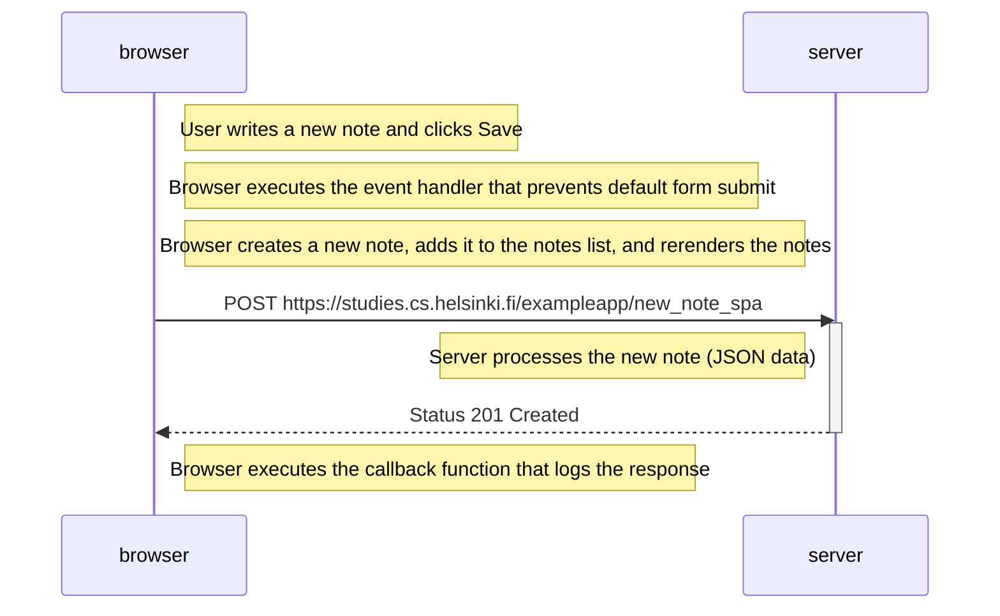

```mermaid
sequenceDiagram
    participant browser
    participant server

    Note right of browser: User writes a new note and clicks Save
    Note right of browser: Browser executes the event handler that prevents default form submit
    Note right of browser: Browser creates a new note, adds it to the notes list, and rerenders the notes

    browser->>server: POST https://studies.cs.helsinki.fi/exampleapp/new_note_spa
    activate server
    Note left of server: Server processes the new note (JSON data)
    server-->>browser: Status 201 Created
    deactivate server

    Note right of browser: Browser executes the callback function that logs the response
```